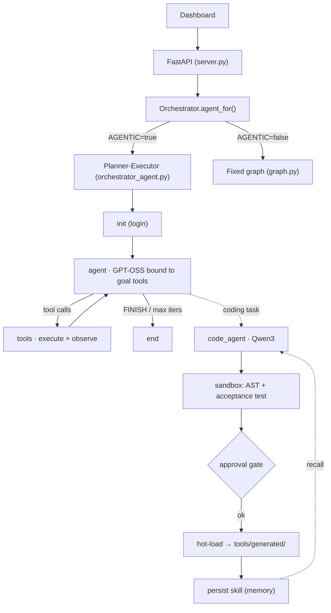

# Architecture

The system runs in one of two modes, chosen by the `AGENTIC` env flag.

- **Legacy (`AGENTIC=false`, default):** three fixed LangGraph sub-graphs — a
  workflow with a single LLM decision node. Predictable, the original design.
- **Agentic (`AGENTIC=true`):** a planner-executor loop where the reasoning model
  (GPT-OSS) owns control flow via tool-calling and can repair itself at runtime
  by delegating coding tasks to the coding model (Qwen3).

Both compile to a LangGraph exposing `.stream()`, so `server.py` runs either
unchanged.

## Two-model layer

Work is routed to one of two Ollama models by **role**, not hardcoded tag
(`tools/model_router.py`):

| Role | Default tag | Handles |
|---|---|---|
| `REASONING_MODEL` | `gpt-oss:120b-cloud` | planning, orchestration, evaluation, outreach writing, classification |
| `CODING_MODEL` | `qwen3-coder:480b-cloud` | generating/repairing selectors, scrapers, form handlers, scripts, debugging |

Every unit of work declares a `TaskKind`; `model_for(kind)` is a dict lookup
(deterministic, free). `classify_kind()` is a heuristic+LLM fallback for
free-form tasks. Both tags are env-configurable.

## Agentic loop



`init → agent ⇄ tools → (loop | end)`. The LLM searches, evaluates each item,
acts, and — when a scraper/selector breaks — calls `code_agent` to write a fix,
which is sandbox-validated, (optionally) approved, hot-loaded, and remembered so
the next occurrence is a recall instead of a regeneration.

## Components

| File | Role |
|---|---|
| `tools/model_router.py` | `TaskKind`, role tags, `model_for` / `llm_for`, classifier |
| `agent/messages.py` | typed protocol: `AgentMessage`, `CodeSpec`, `ToolHandle`, `Plan`, `ToolResult` |
| `agent/tools_registry.py` | callable tools wrapping `tools/*` + `code_agent`; per-goal visibility |
| `agent/orchestrator_agent.py` | the planner-executor LangGraph |
| `agent/code_agent/` | Qwen3 codegen → `sandbox.py` gate → hot-load → register |
| `agent/memory.py` | skill recall/remember over `state/self_heal/skills.json` |
| `agent/orchestrator.py` | dispatch: legacy graph vs agentic loop per `AGENTIC` |
| `agent/graph.py` | legacy fixed graph + the pending-connection sweeper |

## Tool visibility (safety by construction)

Each goal sees only its tools, so the old "JOB can't network / POST can't apply"
property holds without graph edges:

- **JOB:** `search_jobs`, `get_job_details`, `evaluate_fit`, `easy_apply`, `code_agent`, `recall_skill`
- **PERSON:** `search_people`, `extract_profile_details`, `evaluate_fit`, `connect_and_queue_dm`, `code_agent`, `recall_skill`
- **POST:** `scrape_feed`, `evaluate_fit`, `draft_email`, `draft_dm`, `record_apply_link`, `code_agent`, `recall_skill`

Action tools delegate to the legacy nodes, preserving daily caps, dry-run, lead
capture, and **manual-DM-only** (the bot never auto-sends DMs).

## Memory

| Tier | Store |
|---|---|
| Working | `AgentState` (`messages`, scratchpad) |
| Episodic | `tools/db.py`, `applications.py`, `history.py`, `pending.py` |
| Semantic / skill | `state/self_heal/skills.json` (keyed by failure signature) |
| Procedural | `tools/generated/*.py` (hot-loaded skills) |

## Runtime self-coding guardrails

1. **Sandbox-first** — generated code runs against a fixture in a time-limited
   subprocess before touching the live session.
2. **Static allowlist** — AST scan rejects `os`/`subprocess`/`socket`/file-writes/
   `eval`/`exec`/dunder escapes; only parsing + Playwright imports allowed.
3. **Approval gate** — `SELF_CODING_REQUIRE_APPROVAL=true` (default) queues a diff
   for review instead of auto-loading.
4. **Audit trail** — every generation logged to `state/self_heal/`.

## Environment variables

```
AGENTIC=false                          # true → planner-executor loop
REASONING_MODEL=gpt-oss:120b-cloud
CODING_MODEL=qwen3-coder:480b-cloud
OLLAMA_BASE_URL=http://localhost:11434
SELF_CODING_REQUIRE_APPROVAL=true      # gate runtime code before hot-load
AGENTIC_MAX_ITERATIONS=60
```
